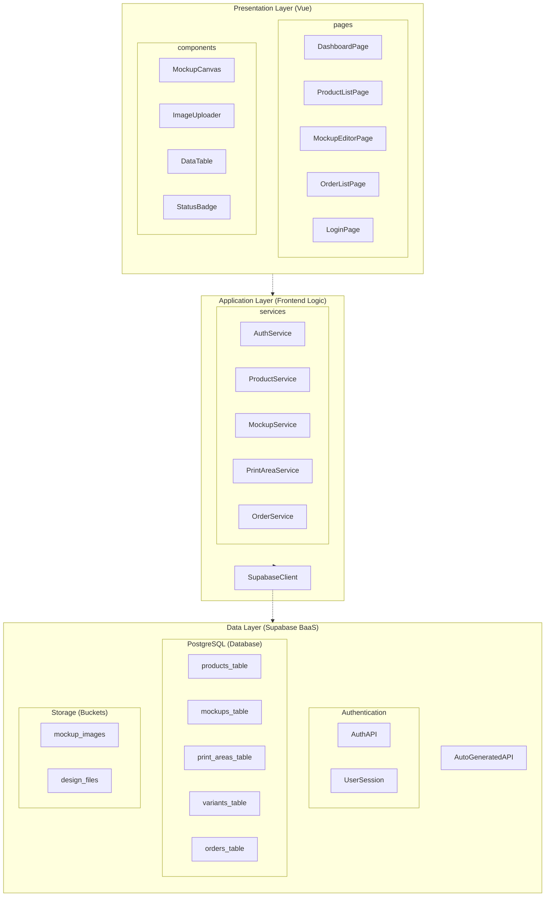

```mermaid
flowchart TB
    %% Tầng Presentation
    subgraph Presentation ["Presentation Layer (Vue)"]
        direction TB
        subgraph pages ["pages"]
            DashboardPage
            ProductListPage
            MockupEditorPage
            OrderListPage
            LoginPage
        end
        subgraph components ["components"]
            MockupCanvas
            ImageUploader
            DataTable
            StatusBadge
        end
    end

    %% Tầng Application
    subgraph Application ["Application Layer (Frontend Logic)"]
        direction TB
        subgraph services ["services"]
            AuthService
            ProductService
            MockupService
            PrintAreaService
            OrderService
        end
        SupabaseClient
    end

    %% Tầng Data
    subgraph Data ["Data Layer (Supabase BaaS)"]
        direction TB
        subgraph Authentication ["Authentication"]
            AuthAPI
            UserSession
        end
        subgraph Database ["PostgreSQL (Database)"]
            products_table
            mockups_table
            print_areas_table
            variants_table
            orders_table
        end
        subgraph Storage ["Storage (Buckets)"]
            mockup_images
            design_files
        end
        AutoGeneratedAPI
    end

    %% Các mối quan hệ phụ thuộc (Mũi tên đứt nét đại diện cho Dependency trong UML)
    Presentation -.-> Application
    Application -.-> SupabaseClient
    SupabaseClient -.-> Data
```
