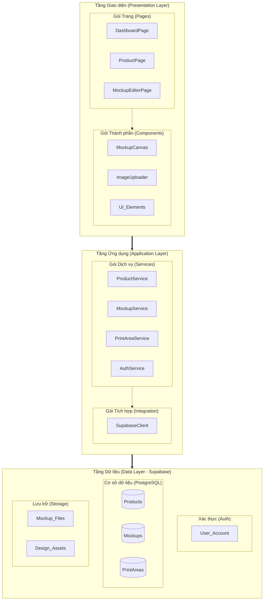

```mermaid
flowchart TB
    %% Tầng Presentation - Chỉ chứa logic hiển thị
    subgraph PresentationLayer ["Tầng Giao diện (Presentation Layer)"]
        direction TB
        subgraph ViewPages ["Gói Trang (Pages)"]
            direction LR
            P1[DashboardPage]
            P2[ProductPage]
            P3[MockupEditorPage]
        end
        subgraph ViewComponents ["Gói Thành phần (Components)"]
            direction LR
            C1[MockupCanvas]
            C2[ImageUploader]
            C3[UI_Elements]
        end
        ViewPages -.-> ViewComponents
    end

    %% Tầng Application - Chứa logic nghiệp vụ điều phối
    subgraph ApplicationLayer ["Tầng Ứng dụng (Application Layer)"]
        direction TB
        subgraph BusinessServices ["Gói Dịch vụ (Services)"]
            direction LR
            S1[ProductService]
            S2[MockupService]
            S3[PrintAreaService]
            S4[AuthService]
        end
        subgraph Integration ["Gói Tích hợp (Integration)"]
            Client[SupabaseClient]
        end
        BusinessServices -.-> Integration
    end

    %% Tầng Data - Quản lý lưu trữ và dữ liệu gốc
    subgraph DataLayer ["Tầng Dữ liệu (Data Layer - Supabase)"]
        direction TB
        subgraph AuthData ["Xác thực (Auth)"]
            UserTable[User_Account]
        end
        subgraph DBData ["Cơ sở dữ liệu (PostgreSQL)"]
            direction LR
            T1[(Products)]
            T2[(Mockups)]
            T3[(PrintAreas)]
        end
        subgraph StorageData ["Lưu trữ (Storage)"]
            direction LR
            B1[Mockup_Files]
            B2[Design_Assets]
        end
    end

    %% Các mối quan hệ phụ thuộc tuân thủ quy tắc thiết kế
    PresentationLayer ==> ApplicationLayer
    ApplicationLayer ==> DataLayer
```
