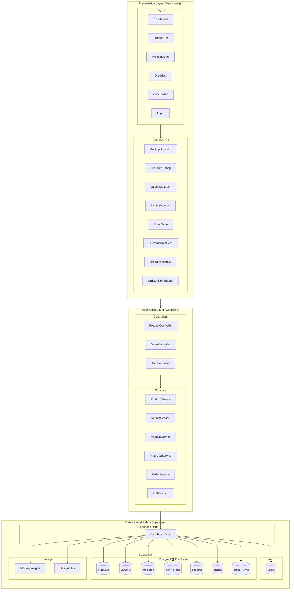

```mermaid
flowchart TB

%% ========================
%% PRESENTATION LAYER (VIEW)
%% ========================
subgraph PresentationLayer ["Presentation Layer (View - Vue.js)"]
    direction TB

    subgraph Pages ["Pages"]
        direction LR
        Dashboard[Dashboard]
        ProductList[ProductList]
        ProductDetail[ProductDetail]
        OrderList[OrderList]
        OrderDetail[OrderDetail]
        Login[Login]
    end

    subgraph Components ["Components"]
        direction LR
        MockupUploader
        PrintAreaConfig
        VariantManager
        DesignPreview
        OrderTable
        CustomerInfoCard
        OrderProductList
        OrderActionButtons
    end

    Pages --> Components
end

%% ========================
%% APPLICATION LAYER (CONTROLLER)
%% ========================
subgraph ApplicationLayer ["Application Layer (Controller)"]
    direction TB

    subgraph Controllers ["Controllers"]
        direction LR
        ProductController
        OrderController
        AuthController
    end

    subgraph Services ["Services"]
        direction LR
        ProductService
        VariantService
        MockupService
        PrintAreaService
        OrderService
        AuthService
    end

    Controllers --> Services
end

%% ========================
%% DATA LAYER (MODEL)
%% ========================
subgraph DataLayer ["Data Layer (Model - Supabase)"]
    direction TB

    subgraph Client ["Supabase Client"]
        SupabaseClient
    end

    subgraph Supabase ["Supabase"]
        direction TB

        subgraph AuthModule ["Auth"]
            Users[(users)]
        end

        subgraph Database ["PostgreSQL Database"]
            Products[(products)]
            Variants[(variants)]
            Mockups[(mockups)]
            PrintAreas[(print_areas)]
            Designs[(designs)]
            Orders[(orders)]
            OrderItems[(order_items)]
        end

        subgraph Storage ["Storage"]
            MockupImages
            DesignFiles
        end
    end

    SupabaseClient --> Users
    SupabaseClient --> Products
    SupabaseClient --> Variants
    SupabaseClient --> Mockups
    SupabaseClient --> PrintAreas
    SupabaseClient --> Designs
    SupabaseClient --> Orders
    SupabaseClient --> OrderItems
    SupabaseClient --> MockupImages
    SupabaseClient --> DesignFiles
end

%% ========================
%% LAYER DEPENDENCIES
%% ========================

PresentationLayer --> ApplicationLayer
ApplicationLayer --> SupabaseClient
```
