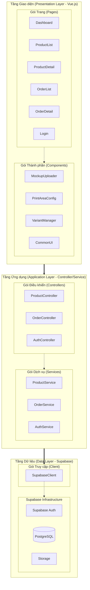

```mermaid
flowchart TB
    %% TẦNG GIAO DIỆN (PRESENTATION LAYER)
    subgraph PresentationLayer ["Tầng Giao diện (Presentation Layer - Vue.js)"]
        direction TB
        subgraph Pages ["Gói Trang (Pages)"]
            direction LR
            P1[Dashboard]
            P2[ProductList]
            P3[ProductDetail]
            P4[OrderList]
            P5[OrderDetail]
            P6[Login]
        end
        subgraph Components ["Gói Thành phần (Components)"]
            direction LR
            C1[MockupUploader]
            C2[PrintAreaConfig]
            C3[VariantManager]
            C4[CommonUI]
        end
        Pages -.-> Components
    end

    %% TẦNG ỨNG DỤNG (APPLICATION LAYER)
    subgraph ApplicationLayer ["Tầng Ứng dụng (Application Layer - Controller/Service)"]
        direction TB
        subgraph Controllers ["Gói Điều khiển (Controllers)"]
            direction LR
            CTL1[ProductController]
            CTL2[OrderController]
            CTL3[AuthController]
        end
        subgraph Services ["Gói Dịch vụ (Services)"]
            direction LR
            S1[ProductService]
            S2[OrderService]
            S3[AuthService]
        end
        Controllers -.-> Services
    end

    %% TẦNG DỮ LIỆU (DATA LAYER)
    subgraph DataLayer ["Tầng Dữ liệu (Data Layer - Supabase)"]
        direction TB
        subgraph Client ["Gói Truy cập (Client)"]
            SC[SupabaseClient]
        end
        subgraph SupabaseModules ["Supabase Infrastructure"]
            direction LR
            Auth[Supabase Auth]
            DB[(PostgreSQL)]
            ST[Storage]
        end
        SC -.-> SupabaseModules
    end

    %% MỐI QUAN HỆ PHỤ THUỘC (DEPENDENCIES)
    PresentationLayer ==> ApplicationLayer
    ApplicationLayer ==> Client
```
