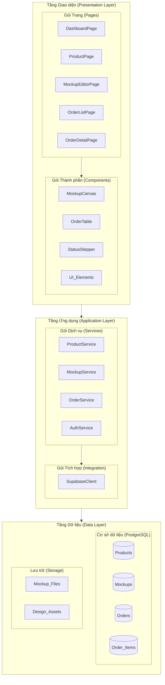

```mermaid
flowchart TB
    %% TẦNG GIAO DIỆN (PRESENTATION LAYER)
    subgraph PresentationLayer ["Tầng Giao diện (Presentation Layer)"]
        direction TB
        subgraph ViewPages ["Gói Trang (Pages)"]
            direction LR
            P1[DashboardPage]
            P2[ProductPage]
            P3[MockupEditorPage]
            P4[OrderListPage]
            P5[OrderDetailPage]
        end
        subgraph ViewComponents ["Gói Thành phần (Components)"]
            direction LR
            C1[MockupCanvas]
            C2[OrderTable]
            C3[StatusStepper]
            C4[UI_Elements]
        end
        ViewPages -.-> ViewComponents
    end

    %% TẦNG ỨNG DỤNG (APPLICATION LAYER)
    subgraph ApplicationLayer ["Tầng Ứng dụng (Application Layer)"]
        direction TB
        subgraph BusinessServices ["Gói Dịch vụ (Services)"]
            direction LR
            S1[ProductService]
            S2[MockupService]
            S3[OrderService]
            S4[AuthService]
        end
        subgraph Integration ["Gói Tích hợp (Integration)"]
            Client[SupabaseClient]
        end
        BusinessServices -.-> Integration
    end

    %% TẦNG DỮ LIỆU (DATA LAYER)
    subgraph DataLayer ["Tầng Dữ liệu (Data Layer)"]
        direction TB
        subgraph DBData ["Cơ sở dữ liệu (PostgreSQL)"]
            direction LR
            T1[(Products)]
            T2[(Mockups)]
            T3[(Orders)]
            T4[(Order_Items)]
        end
        subgraph StorageData ["Lưu trữ (Storage)"]
            direction LR
            B1[Mockup_Files]
            B2[Design_Assets]
        end
    end

    %% Mối quan hệ phụ thuộc tuân thủ quy tắc thiết kế
    PresentationLayer -.-> ApplicationLayer
    ApplicationLayer -.-> DataLayer
```
