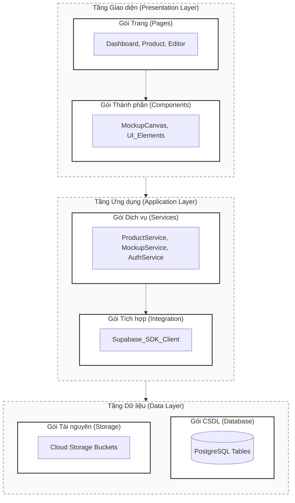

```mermaid
flowchart TB
    %% Định nghĩa phong cách cho các khối
    classDef package fill:#fff,stroke:#333,stroke-width:2px;
    classDef layer fill:#f9f9f9,stroke:#666,stroke-width:1px,stroke-dasharray: 5 5;

    %% TẦNG GIAO DIỆN (PRESENTATION LAYER)
    subgraph PresentationLayer ["&nbsp; Tầng Giao diện (Presentation Layer) &nbsp;"]
        direction TB
        subgraph Pages ["Gói Trang (Pages)"]
            P[Dashboard, Product, Editor]
        end
        subgraph Components ["Gói Thành phần (Components)"]
            C[MockupCanvas, UI_Elements]
        end
        Pages -.-> Components
    end

    %% TẦNG ỨNG DỤNG (APPLICATION LAYER)
    subgraph ApplicationLayer ["&nbsp; Tầng Ứng dụng (Application Layer) &nbsp;"]
        direction TB
        subgraph Services ["Gói Dịch vụ (Services)"]
            S[ProductService, MockupService, AuthService]
        end
        subgraph Integration ["Gói Tích hợp (Integration)"]
            I[Supabase_SDK_Client]
        end
        Services -.-> Integration
    end

    %% TẦNG DỮ LIỆU (DATA LAYER)
    subgraph DataLayer ["&nbsp; Tầng Dữ liệu (Data Layer) &nbsp;"]
        direction TB
        subgraph Database ["Gói CSDL (Database)"]
            DB[(PostgreSQL Tables)]
        end
        subgraph Assets ["Gói Tài nguyên (Storage)"]
            ST[Cloud Storage Buckets]
        end
    end

    %% CÁC MỐI QUAN HỆ PHỤ THUỘC (DEPENDENCIES)
    PresentationLayer -.-> ApplicationLayer
    ApplicationLayer -.-> DataLayer

    %% Gán class để làm đẹp
    class Pages,Components,Services,Integration,Database,Assets package;
    class PresentationLayer,ApplicationLayer,DataLayer layer;
```
